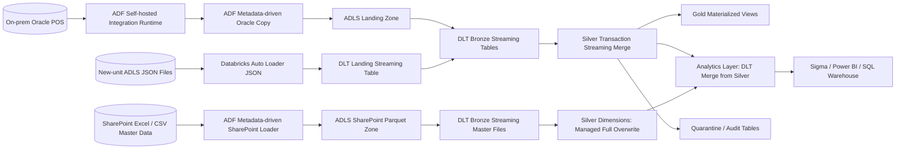

# Lead Data Engineer Portfolio Project: Global Travel Retail Sales Lakehouse

> **Candidate positioning:** Lead Data Engineer / Data Architect / Solution Architect  
> **Portfolio owner:** Sayak Chattopadhyay  
> **LinkedIn:** https://www.linkedin.com/in/sayakc44/  
> **Domain:** Travel retail, food & beverage, sales, inventory, energy analytics  
> **Cloud stack:** Azure Data Factory, Self-hosted Integration Runtime, ADLS Gen2, Databricks, Delta Lake, Delta Live Tables / Lakeflow Declarative Pipelines, Databricks Asset Bundles, Unity Catalog

This repository is a GitHub-ready portfolio project based on an anonymised, enterprise-scale retail sales data platform pattern. It is designed to show the depth expected from a **Lead Data Engineer**: platform architecture, metadata-driven ingestion, streaming + batch processing, medallion architecture, quality controls, deduplication of reposted sales data, analytics-ready gold models, and deployment automation.

The project is intentionally written as if it were a real implementation handover: code comments, design decisions, deployment notes, data contracts, and business use cases are included so hiring managers can inspect both technical depth and architectural thinking.

---

## 1. What this project demonstrates

| Capability | What the repo shows |
|---|---|
| Enterprise lakehouse architecture | Landing, Bronze, Silver, Gold, and Analytics layers with clear contracts |
| Azure Data Factory | Metadata-driven Oracle-to-ADLS plus SharePoint Excel/CSV-to-ADLS-parquet ingestion using control-table configuration |
| On-prem connectivity | Self-hosted Integration Runtime pattern for Oracle source extraction |
| Databricks engineering | DLT / Lakeflow streaming tables, Auto Loader JSON ingestion, streaming merge, full-overwrite dimensions, materialized views |
| Databricks Asset Bundles | Source-controlled deployment definition for pipelines and jobs |
| Deep sales-domain logic | Cancelled/returned transactions, reposted data, business-date dedupe, net sales calculation |
| Retail analytics | Combo pricing, enhanced quantity, ATV, 15-minute trading buckets, break-even opening/closing analysis |
| Platform leadership | CI/CD, testable transformations, coding standards, documentation, extensibility |

---

## 2. Business scenario

A global travel-retail business needs to ingest sales data from an on-prem Oracle point-of-sale estate across **38 countries**. The pipeline runs **6 times per day** and processes high-volume transaction details across product, payment, discount, unit, location, and country dimensions.

The platform must support:

1. **Operational sales reporting** by country, location, unit, business date, and product.
2. **Reposted transaction handling** where transaction records can be corrected after the original sale date.
3. **Cancelled and returned sales handling** without inflating revenue or quantity.
4. **Net sales calculation:** `gross_sales - discount_amount - tax_amount`.
5. **Combo analytics** comparing product price when sold inside a combo versus separately.
6. **Enhanced quantity logic** excluding kitchen instructions such as `medium`, `rare`, `hot`, `with ice`, and excluding unpriced products.
7. **Opening and closing time optimisation** using 15-minute sales buckets and running-cost thresholds.
8. **Discount strategy analytics** by discount type, discount name, product, location, and country.

---

## 3. Target architecture




---

## 3.1 Layer and table-management strategy

This version models the pattern more accurately for a mixed batch + streaming enterprise lakehouse:

| Layer | Pattern in this repo | Why it matters |
|---|---|---|
| Landing | ADLS JSON files from new units are ingested with Auto Loader into a DLT streaming landing table | New units can be onboarded quickly without waiting for Oracle integration |
| Bronze | All raw source tables are DLT streaming tables | Keeps incremental ingestion, audit columns, schema evolution and DQ flags consistent |
| Silver dimensions | Managed tables refreshed by full overwrite from SharePoint master data | Master data such as unit, country, daily budget, forecast and overrides is small but business-owned |
| Silver transactions | DLT streaming merge using business keys and sequence columns | Corrected/reposted sales do not double count revenue |
| Complex Silver | Materialized views where business logic is expensive or reused | Optimises repeatable transformations and governance |
| Gold | Materialized views for aggregated data products | Good for performance and curated KPI consumption |
| Analytics | DLT merge table built directly from Silver | BI users get denormalised data while retaining transaction-level drill-through |

Important design decision: **the Analytics layer is built from Silver, not Gold**. Gold is used for aggregated data products, while Analytics remains denormalised and transactional enough for reconciliation.

---

## 4. Repository structure

```text
.
├── .github/workflows/ci.yml                     # Unit-test workflow for pull requests
├── adf/                                         # Azure Data Factory metadata-driven pattern
│   ├── metadata/control_table_schema.sql
│   ├── metadata/sample_control_rows.csv
│   ├── pipelines/pl_metadata_driven_oracle_to_adls.json
│   ├── pipelines/pl_metadata_driven_sharepoint_to_adls_parquet.json
│   ├── linked_services/ls_oracle_shir_template.json
│   └── linked_services/ls_sharepoint_keyvault_template.json
├── data/synthetic/                              # Small synthetic datasets for quick testing
├── databricks.yml                               # Databricks Asset Bundle root config
├── docs/                                        # Architecture, data model, deployment and interview notes
├── resources/                                   # Databricks jobs/pipeline bundle resources
├── scripts/generate_synthetic_data.py           # Regenerates local test data
├── src/dlt/pipeline_global_sales_lakehouse.py   # DLT / Lakeflow pipeline implementation
├── src/retail_lakehouse/                        # Local, testable transformation functions
├── sql/analytics/                               # Analytics-layer SQL views
└── tests/                                       # Unit tests for critical business logic
```

---

## 5. Quick start for local testing

This repo includes pandas-based transformation functions so reviewers can run tests without a Databricks workspace.

```bash
python -m venv .venv
source .venv/bin/activate
pip install -e .[dev]
python scripts/generate_synthetic_data.py --output-dir data/synthetic --days 10 --seed 44
pytest -q
```

Expected result:

```text
8 passed
```

---

## 5.1 Synthetic sample coverage

The synthetic dataset now includes:

- Oracle-style POS transaction CSV extracts.
- New-unit ADLS JSON sales files for Auto Loader testing.
- SharePoint-style master-data source files for unit, country, daily budget, forecast, product hierarchy corrections, product exclusions, combo average price overrides and unit mapping overrides.
- Energy meter readings for 15-minute profitability analysis.

The local generator writes SharePoint samples as CSV to keep the repo lightweight; the ADF production pattern converts SharePoint Excel/CSV files to ADLS parquet before Databricks ingestion.

---

## 6. Databricks deployment outline

> This section is intentionally deployment-oriented because Lead Data Engineer interviews often test whether the candidate can move beyond notebooks into controlled release management.

1. Configure `databricks.yml` variables for catalog, schema, storage path, and workspace host.
2. Validate the bundle:

```bash
databricks bundle validate -t dev
```

3. Deploy the pipeline and job definitions:

```bash
databricks bundle deploy -t dev
```

4. Run the pipeline job:

```bash
databricks bundle run retail_sales_lakehouse_job -t dev
```

---

## 7. Key design choices

### Business-date dedupe for reposted data

Sales systems often repost corrected transactions after the original business date. A naive append-only pipeline double-counts sales. This project keeps the latest record for each `(business_date, transaction_id, transaction_line_id)` using source sequence and update timestamp.

### Bronze keeps raw evidence

Bronze is not over-cleaned. It keeps ingestion metadata, source file name, extraction timestamp, and DQ flags so platform teams can audit the source-to-report lineage.


### SharePoint master-data ingestion

The project includes a second metadata-driven ADF pattern for business-owned SharePoint files. Control rows define the SharePoint URL, folder path, file name, file format, worksheet name, entity name and Key Vault secret names for the app registration. The pipeline removes spaces from SharePoint folder names before writing parquet to ADLS, for example:

```text
Shared Documents/Product Hierarchy Corrections
→ sharepoint_master/shareddocuments_producthierarchycorrections/producthierarchycorrections/*.parquet
```

This supports master data such as unit, country, daily budget, forecast, product hierarchy corrections, product exclusions, combo average price overrides and unit mapping overrides.

### Silver owns business semantics

Silver calculates net sales, standardises cancelled/returned records, applies enhanced quantity logic, and creates quarter-hour trading buckets.

### Gold is aggregated; Analytics is built from Silver

Gold contains materialized views for aggregated data products such as discount strategy and 15-minute profitability. The Analytics layer is intentionally built directly from Silver, not Gold, so business users can use denormalised BI-ready tables while still drilling back to transaction-line detail.

---

## 8. Hiring-manager talking points

Use this project in interviews to discuss:

- How you designed metadata-driven ingestion instead of building one-off pipelines per table.
- Why reposted sales data breaks simple incremental loads.
- How to separate technical quality checks from business quality checks.
- How to manage batch and streaming patterns in the same lakehouse.
- How to optimise cost through incremental processing, partitioning, clustering, and controlled job schedules.
- How to provide commercial analytics beyond simple sales reporting.

---

## 9. Portfolio expansion plan

This is **Project 1**. Suggested next two projects:

1. **Energy + IoT Streaming Lakehouse:** streaming energy meter data, anomaly detection, cost allocation, and unit-level sustainability analytics.
2. **Inventory & Replenishment Data Product:** inventory snapshots, sales velocity, waste reduction, stockout risk, and demand forecasting features.

See [`docs/portfolio_roadmap.md`](docs/portfolio_roadmap.md) for a more detailed plan.
